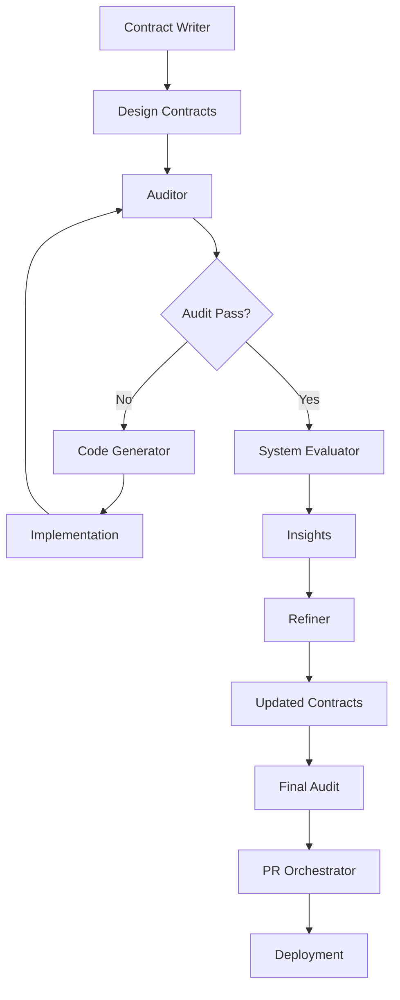

# Agentic Design Contracts (ADC)

[](https://opensource.org/licenses/MIT)
[](https://www.python.org/downloads/)

A framework for designing and building AI-driven systems using specialized roles and machine-readable design contracts.

## 🚀 Quick Start

```bash
# Install the ADC tool
pip install -e .

# Install AI provider packages (choose one or more)
pip install -e ".[anthropic]"  # For Claude
pip install -e ".[openai]"      # For GPT
pip install -e ".[gemini]"      # For Gemini
pip install -e ".[all]"         # All providers

# Set up API keys
export ANTHROPIC_API_KEY="your-key"
export OPENAI_API_KEY="your-key"
export GOOGLE_API_KEY="your-key"

# Using ADC loops with Claude Code via the /adc claude command
% cd agent-design-contracts
% claude
/adc create contracts in my-repo/contracts for XYZ
/adc run ADC loops to implement my-report/contracts


# Working with specific ADC roles in any agent in your IDE
## First, insure that your IDE as visibility into the ADC pkg 
## by adding manually or... e.g.
ln agent-design-contracts my-repo/adc

## 1. Make contracts
as @contract_writer.md create contracts in my-repo/contracts to implement XYZ

## 2. Audit
as @auditor.md analysis my my-repo/

## 3. Write code
as @code_generator.md implement the recommendations from the Auditor

## 4. Audit again
as @auditor.md audit my new code

## 5a. Software is in compliance - evaluate
as @system_evaluator.md evaluate my software

## 6. Refine
as @refiner.md update my contracts based on evaluator insights

## 5b. Software not in compliance - fix
as @refiner.md and @code_generator.md fix the contracts and code based on the audit
```

## 📖 What is ADC?

**Agentic Design Contracts (ADC)** is a methodology that bridges the gap between system design and implementation through:

1. **Machine-readable contracts** - Design documents in a structured Markdown format that both humans and AI can understand
2. **Specialized AI agents** - Purpose-built agents for code generation, auditing, and refinement
3. **Traceable implementation** - Direct linking between design blocks and code through ADC-IMPLEMENTS markers
4. **Continuous validation** - Automated detection of design drift and compliance issues

### Key Benefits

- **Single Source of Truth**: Contracts serve as the authoritative design specification
- **Automated Development**: AI agents handle routine implementation tasks
- **Design-Code Parity**: Automatic verification that code matches design intent
- **Cross-Team Collaboration**: Shared language for developers, architects, and AI agents

## 🏗️ Architecture

### Core Components

```
agent-design-contracts/
├── .claude/commands/adc.md  # Claude Code command
├── adc-schema.qmd           # Contract schema definition
├── roles/                   # AI agent role definitions
│   ├── code_generator.md    # Generates code from contracts
│   ├── auditor.md          # Audits code compliance
│   └── refiner.md          # Improves contract quality
└── contracts/              # Example ADC contracts

### CLI for git integration
```
agent-design-contracts/
├── src/adc_cli/            # CLI tool implementation
│   ├── providers.py        # AI provider integrations
│   ├── commands.py         # Command implementations
│   └── config.py           # Configuration management
```

### The ADC Workflow



1. **Contract Writer** creates initial design contracts
2. **Auditor** reviews contracts for completeness and compliance
3. **Code Generator** implements the contracts
4. **Auditor** verifies implementation matches contracts (loop until compliance)
5. **System Evaluator** analyzes the compliant system for improvements
6. **Refiner** updates contracts based on evaluator insights
7. **Auditor** performs final validation
8. **PR Orchestrator** manages the deployment process

## 📝 Contract Schema

ADC contracts use typed design blocks to specify system components:

### Example Contract

```markdown
---
contract_id: "my-system-adc-001"
title: "My System Design"
status: "active"
version: 1.0
---

### [Agent: Data Processor] <data-processor-01>
Processes incoming data streams with validation and transformation.

**Persona:** Senior Data Engineer
**Thinking Process:**
1. Validate input format
2. Apply transformations
3. Output to storage

**Parity:**
- **Implementation Scope:** `src/processors/`
- **Tests:** `tests/test_processors.py`

### [DataModel: ProcessedData] <processed-data-01>
Represents processed data ready for storage.

- `id: str` - Unique identifier
- `timestamp: datetime` - Processing time
- `data: dict` - Processed payload

**Parity:**
- **Implementation Scope:** `src/models/processed_data.py`
```

### Block Types

- **`[Agent]`** - Autonomous agents with personas and algorithms
- **`[DataModel]`** - Data structures and schemas
- **`[Algorithm]`** - Business logic and calculations
- **`[Tool]`** - External services and integrations
- **`[Feature]`** - User-facing capabilities
- **`[TestScenario]`** - Test cases and edge cases

For complete schema documentation, see [adc-schema.qmd](adc-schema.qmd).

## 🤖 AI Agents

### Code Generator
- **Role**: Senior Staff Software Engineer
- **Purpose**: Transforms contracts into production code
- **Features**: Type hints, error handling, ADC-IMPLEMENTS markers

### Auditor
- **Role**: Principal Engineer & Systems Architect
- **Purpose**: Verifies code compliance with contracts
- **Detects**: Missing implementations, design drift, anti-patterns

### Refiner
- **Role**: Senior Technical Product Manager
- **Purpose**: Improves contract clarity and completeness
- **Focus**: Gap analysis, consistency, specification quality

## 🛠️ Installation

### Prerequisites

- Python 3.9 or higher
- pip package manager
- API keys for AI providers (optional, based on usage)

### Install from Source

```bash
git clone https://github.com/OwlDuet-Labs/agent-design-contracts.git
cd agent-design-contracts
pip install -e .
```

### Install with AI Providers

```bash
# Install with specific providers
pip install -e ".[anthropic]"
pip install -e ".[openai]"
pip install -e ".[gemini]"

# Or install all providers
pip install -e ".[all]"
```

## 📚 Documentation

- [CLI Tool Guide](docs/README-adc-cli.md) - Detailed command usage
- [Contract Schema](adc-schema.qmd) - Complete schema reference
- [Contract Linting](docs/CONTRACT_LINTING.md) - Contract validation rules
- [Examples](contracts/) - Sample ADC contracts

## 🧪 Testing

```bash
# Run all tests
pytest

# Run with coverage
pytest --cov=adc_cli --cov-report=term-missing

# Run specific test file
pytest tests/test_providers.py -v
```

## 🤝 Contributing

We welcome contributions! Please see [CONTRIBUTING.md](CONTRIBUTING.md) for guidelines.

### Development Setup

```bash
# Clone repository
git clone https://github.com/OwlDuet-Labs/agent-design-contracts.git
cd agent-design-contracts

# Create virtual environment
python -m venv .venv
source .venv/bin/activate  # On Windows: .venv\Scripts\activate

# Install in development mode with all dependencies
pip install -e ".[all]"
pip install -r requirements-dev.txt  # If available

# Run tests to verify setup
pytest
```

## 📄 License

This project is licensed under the MIT License - see [LICENSE](LICENSE) for details.

## 🙏 Acknowledgments

- Built with support from Anthropic, OpenAI, and Google AI APIs
- Inspired by design-by-contract methodologies
- Community contributions and feedback

## 📮 Contact

- **Author**: Thomas A Drake (@t4mber)
- **GitHub**: [@OwlDuet-Labs](https://github.com/OwlDuet-Labs)
- **Issues**: [GitHub Issues](https://github.com/OwlDuet-Labs/agent-design-contracts/issues)

## 🗺️ Roadmap

- [ ] VS Code extension for ADC syntax highlighting
- [ ] Contract versioning and migration tools
- [ ] Integration with CI/CD pipelines

---

**Note**: This project is in active development. APIs and schemas may change between versions.
