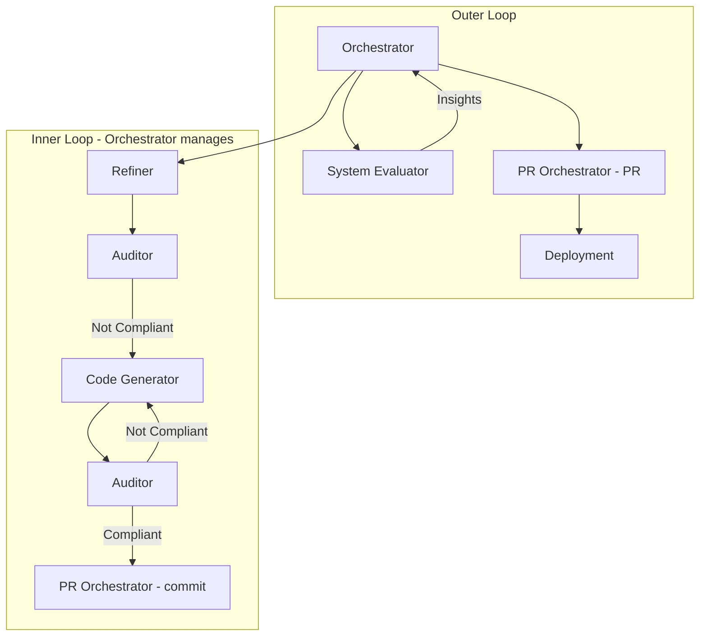

# Agentic Design Contracts (ADC)

[](https://opensource.org/licenses/MIT)
[](https://www.python.org/downloads/)

A framework for designing and building AI-driven systems using specialized roles and machine-readable design contracts.

## 🚀 Quick Start

> **📖 For detailed setup instructions, see the [Setup Guide](docs/SETUP_GUIDE.md)**

```bash
# Install the ADC tool
pip install -e .

# Install AI provider packages (choose one or more)
pip install -e ".[anthropic]"  # For Claude
pip install -e ".[openai]"      # For GPT
pip install -e ".[gemini]"      # For Gemini
pip install -e ".[all]"         # All providers
pip install -e ".[mcp]"         # MCP server for IDE integration

# Initialize ADC project structure
adc init                        # Creates contracts/, adc_files/, claude_tmp/

# Set up API keys
export ANTHROPIC_API_KEY="your-key"
export OPENAI_API_KEY="your-key"
export GOOGLE_API_KEY="your-key"

# Set up MCP server for your IDE (Windsurf, Cursor, Claude Desktop, etc.)
adc setup-mcp                   # Auto-detects and configures all installed clients
```

### Usage with Any MCP-Compatible IDE (Windsurf, Cursor, Claude Desktop, etc.)

```bash
# The MCP server exposes 14 tools, 9 role-based prompts, and resources.
# Just ask your AI assistant to use ADC prompts:

"Use adc-workflow to build a user authentication system"
"Use adc-generate-code to implement the contracts"
"Use adc-audit-compliance to check my project"
"Use adc-write-contracts for a payment processing system"
"Use adc-refine-contracts on contracts/adc-001.md"
"Use adc-evaluate-system to test the API endpoints"
"Use adc-initialize to create contracts for this project"
```

### Usage with Claude Code

```bash
## 0. Launch claude and run the following prompts
% cd my-repo
% claude

## 1a. Start from scratch: make contracts for a new project from a specification
as @adc-contract-writer create contracts based on my @docs/my-design-spec.md

## 1b. Initialize an existing repo: create contracts from software & add markers
as @adc-initialize initialize this project

## 2. Run the ADC agent loop
as @adc-workflow-orchestrator implement @contracts/ following a roadmap with phases

## 3. Refactor with the ADC agent loop
as @adc-refactorer implement specific refactor based a temporary contract

## 4. Evaluate and stress test the software (single agent)
as @adc-system-evaluator run my system and provide insights in ADC-INSIGHTS.md

## 5. Refine contracts (single agent)
as @adc-contract-refiner modify contracts based on recommendations in @ADC-INSIGHTS.md

## 6. Write code (single agent)
as @adc-code-generator implement implement and test this feature: ...

## 7. Audit again and again...
as @adc-compliance-auditor audit this new implementations @contract/adc-005-new-feature.md and@contract/adc-001-overview.md

## 8. Software not in compliance - so fix
as @adc-contract-refiner and @adc-code-generator fix the contracts and code based on the audit
```

## 📖 What is ADC?

**Agentic Design Contracts (ADC)** is a methodology that bridges the gap between system design and implementation through:

1. **Machine-readable contracts** - Design documents in a structured Markdown format that both humans and AI can understand
2. **Specialized AI agents** - Purpose-built agents for code generation, auditing, and refinement
3. **Traceable implementation** - Direct linking between design blocks and code through ADC-IMPLEMENTS markers
4. **Continuous validation** - Automated detection of design drift and compliance issues

### Key Benefits

- **Single Source of Truth**: Contracts serve as the authoritative design specification
- **Automated Development**: AI agents handle routine implementation tasks
- **Design-Code Parity**: Automatic verification that code matches design intent
- **Cross-Team Collaboration**: Shared language for developers, architects, and AI agents

## 🏗️ Architecture

### Core Components

```
agent-design-contracts/
├── .claude/commands/adc.md  # Claude Code command
├── adc-schema.md            # Contract schema definition
├── roles/                   # AI agent role definitions
│   ├── code_generator.md    # Generates code from contracts
│   ├── auditor.md           # Audits code compliance
│   └── refiner.md           # Improves contract quality
├── contracts/               # Example ADC contracts
└── src/adc_cli/             # CLI tool implementation
    ├── providers.py         # AI provider integrations
    ├── commands.py          # Command implementations
    ├── config.py            # Configuration management
    └── mcp_server/          # MCP server for universal IDE integration
        ├── server.py        # Server with stdio transport
        ├── tools.py         # 14 tools (local + AI-powered)
        ├── resources.py     # Schema, roles, config resources
        └── prompts.py       # 9 role-based prompt templates
```

### The ADC Workflow


```mermaid
graph TD
    subgraph Outer["Outer Loop"]
        O[Orchestrator] --> E[System Evaluator]
        E --> |Insights| O
        O --> PR[PR Orchestrator - PR]
        PR --> Deploy[Deployment]
    end

    subgraph Inner["Inner Loop - Orchestrator manages"]
        Ref[Refiner] --> A1[Auditor]
        A1 --> |Not Compliant| CG[Code Generator]
        CG --> A2[Auditor]
        A2 --> |Not Compliant| CG
        A2 --> |Compliant| Commit[PR Orchestrator - commit]
    end

    O --> Ref
```

1. **Contract Writer** creates initial design contracts
2. **Auditor** reviews contracts for completeness and compliance
3. **Code Generator** implements the contracts
4. **Auditor** verifies implementation matches contracts (loop until compliance)
5. **System Evaluator** analyzes the compliant system for improvements
6. **Refiner** updates contracts based on evaluator insights
7. **Auditor** performs final validation
8. **PR Orchestrator** manages the deployment process

## 📝 Contract Schema

ADC contracts use typed design blocks to specify system components:

### Example Contract

```markdown
---
contract_id: "my-system-adc-001"
title: "My System Design"
status: "active"
version: 1.0
---

### [Agent: Data Processor] <data-processor-01>
Processes incoming data streams with validation and transformation.

**Persona:** Senior Data Engineer
**Thinking Process:**
1. Validate input format
2. Apply transformations
3. Output to storage

**Parity:**
- **Implementation Scope:** `src/processors/`
- **Tests:** `tests/test_processors.py`

### [DataModel: ProcessedData] <processed-data-01>
Represents processed data ready for storage.

- `id: str` - Unique identifier
- `timestamp: datetime` - Processing time
- `data: dict` - Processed payload

**Parity:**
- **Implementation Scope:** `src/models/processed_data.py`
```

### Block Types

- **`[Agent]`** - Autonomous agents with personas and algorithms
- **`[DataModel]`** - Data structures and schemas
- **`[Algorithm]`** - Business logic and calculations
- **`[Tool]`** - External services and integrations
- **`[Feature]`** - User-facing capabilities
- **`[TestScenario]`** - Test cases and edge cases

For complete schema documentation, see [adc-schema.md](adc-schema.md).

## 🤖 AI Agents

### Code Generator
- **Role**: Senior Staff Software Engineer
- **Purpose**: Transforms contracts into production code
- **Features**: Type hints, error handling, ADC-IMPLEMENTS markers

### Auditor
- **Role**: Principal Engineer & Systems Architect
- **Purpose**: Verifies code compliance with contracts
- **Detects**: Missing implementations, design drift, anti-patterns

### Refiner
- **Role**: Senior Technical Product Manager
- **Purpose**: Improves contract clarity and completeness
- **Focus**: Gap analysis, consistency, specification quality

## 🛠️ Installation

### Prerequisites

- Python 3.9 or higher
- pip package manager
- API keys for AI providers (optional, based on usage)

### Install from Source

```bash
git clone https://github.com/OwlDuet-Labs/agent-design-contracts.git
cd agent-design-contracts
pip install -e .
```

### Install with AI Providers

```bash
# Install with specific providers
pip install -e ".[anthropic]"
pip install -e ".[openai]"
pip install -e ".[gemini]"

# Or install all providers
pip install -e ".[all]"
```

### Install MCP Server (Universal IDE Integration)

```bash
# Install with MCP support
pip install -e ".[mcp]"

# Auto-configure all detected IDEs
adc setup-mcp

# Or configure a specific client
adc setup-mcp --client windsurf
adc setup-mcp --client cursor
adc setup-mcp --client claude-desktop
adc setup-mcp --client continue
```

After running `adc setup-mcp`, restart your IDE. The ADC MCP server provides:

| Capability | Count | Description |
|-----------|-------|-------------|
| **Tools** | 14 | `adc_init`, `adc_lint`, `adc_validate`, `adc_health`, `adc_config_show`, `adc_config_set`, `adc_list_contracts`, `adc_parse_contract`, `adc_find_markers`, `adc_get_role`, `adc_list_roles`, `adc_generate`, `adc_audit`, `adc_refine` |
| **Prompts** | 9 | `adc-workflow`, `adc-generate-code`, `adc-audit-compliance`, `adc-refine-contracts`, `adc-write-contracts`, `adc-evaluate-system`, `adc-initialize`, `adc-manage-release`, `adc-refactor` |
| **Resources** | 10+ | `adc://schema`, `adc://config`, `adc://roles/{name}` |

## 📚 Documentation

- [Setup Guide](docs/SETUP_GUIDE.md) - **Complete guide for using ADC in your projects**
- [CLI Tool Guide](docs/README-adc-cli.md) - Detailed command usage
- [Contract Schema](adc-schema.md) - Complete schema reference
- [Contract Linting](docs/CONTRACT_LINTING.md) - Contract validation rules
- [Examples](contracts/) - Sample ADC contracts

## 🧪 Testing

```bash
# Run all tests
pytest

# Run with coverage
pytest --cov=adc_cli --cov-report=term-missing

# Run specific test file
pytest tests/test_providers.py -v
```

## 🤝 Contributing

We welcome contributions! Please see [CONTRIBUTING.md](CONTRIBUTING.md) for guidelines.

### Development Setup

```bash
# Clone repository
git clone https://github.com/OwlDuet-Labs/agent-design-contracts.git
cd agent-design-contracts

# Create virtual environment
python -m venv .venv
source .venv/bin/activate  # On Windows: .venv\Scripts\activate

# Install in development mode with all dependencies
pip install -e ".[all]"
pip install -r requirements-dev.txt  # If available

# Run tests to verify setup
pytest
```

## 📄 License

This project is licensed under the MIT License - see [LICENSE](LICENSE) for details.

## 🙏 Acknowledgments

- Built with support from Anthropic, OpenAI, and Google AI APIs
- Inspired by design-by-contract methodologies
- Community contributions and feedback

## 📮 Contact

- **Authors**: Thomas A Drake (@t4mber) & OwlDuet-Labs Team
- **GitHub**: [@OwlDuet-Labs](https://github.com/OwlDuet-Labs)
- **Issues**: [GitHub Issues](https://github.com/OwlDuet-Labs/agent-design-contracts/issues)

## 🗺️ Roadmap

- [x] MCP server for universal IDE integration (Windsurf, Cursor, Claude Desktop, Continue)
- [x] Token usage reduction (via MCP tools replacing raw file reads)
- [ ] System-level verification

---

**Note**: This project is in active development. APIs and schemas may change between versions.
